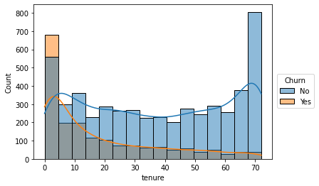
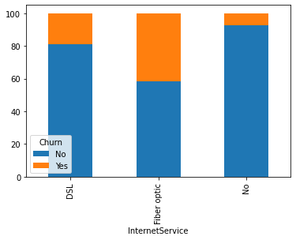
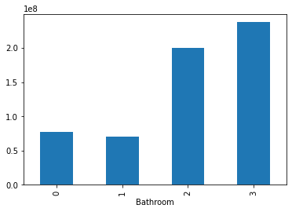
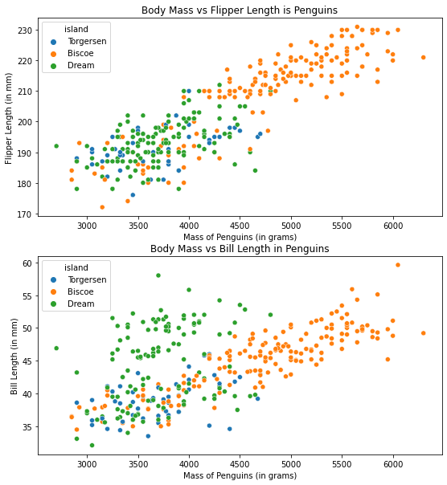

# Data Visualization - Machine Learning

Visualize data from 3 different datasets, namely Telco Customer Churn, Apartment Data, and Penguins from orders that have been given

## Visualization
1.  a) Gambarlah histogram dari kolom 'Tenure', dan pisahkan dengan warna berdasarkan Churn. Namun, pada visualisasi tersebut, tambahkan pula 'Density Plot' di atas Histogram
       
      
    b) Buatlah Stacked Bar Chart yang memperlihatkan rasio dari kolom 'InternetService' terhadap customer-customer yang Churn dan Non Churn
       
       
2.  Buatlah sebuah bar plot di mana sumbu-x adalah kolom Bathroom, dan sumbu-y adalah kolom AnnualPrice (yang dirata-ratakan menurut kolom Bathroom). Jadi, kita ingin melihat, berapa AnnualPrice rata-rata untuk apartement yang memiliki 0, 1, 2, 3 Bathroom
    
    
3. Buatlah visualisasi scatterplot menggunakan Sub Plots, Terdapat 2 Sub Plots yang akan dibuat, dengan ketentuan berikut:
   - Terdapat 2 scatterplot. Posisi subplots adalah 1 kolom dan 2 baris. Artinya, kedua scatterplot yang akan kita gambar akan saling tumpuk-menumpuk (ada yang di atas, ada yang di bawah).
   - Scatterplot pertama: sumbu-x: body_mass_g, sumbu-y: flipper_length_mm
   - Scatterplot kedua: sumbu-x: body_mass_g, sumbu-y: bill_length_mm
   - Scatterplot diberi warna berdasarkan kolom island. Terserah menggunakan color palette apa pun.
   - Gantilah nama dari masing-masing sumbu sehingga lebih menarik dan enak dibaca (tidak di-set default)
   - Berilah judul dari visualisasi yang dibuat (bebas, asal jangan kosong)
   
